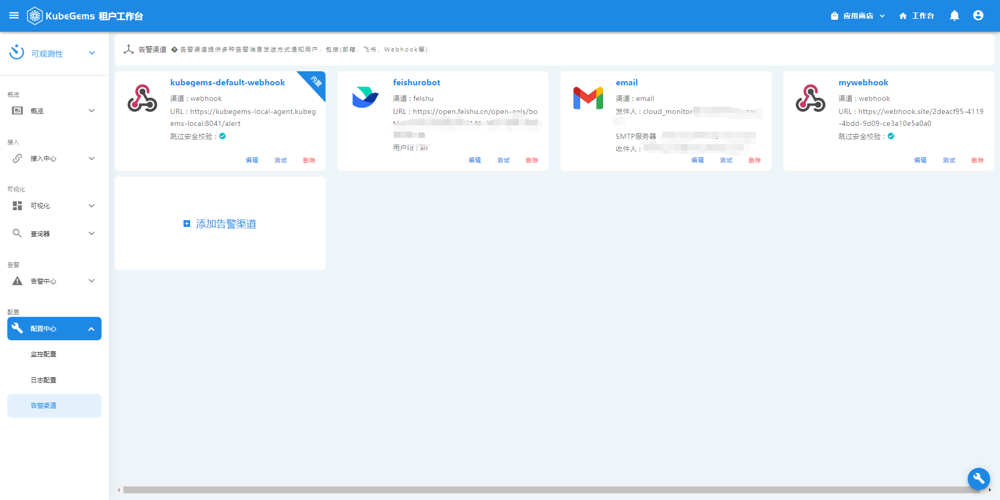
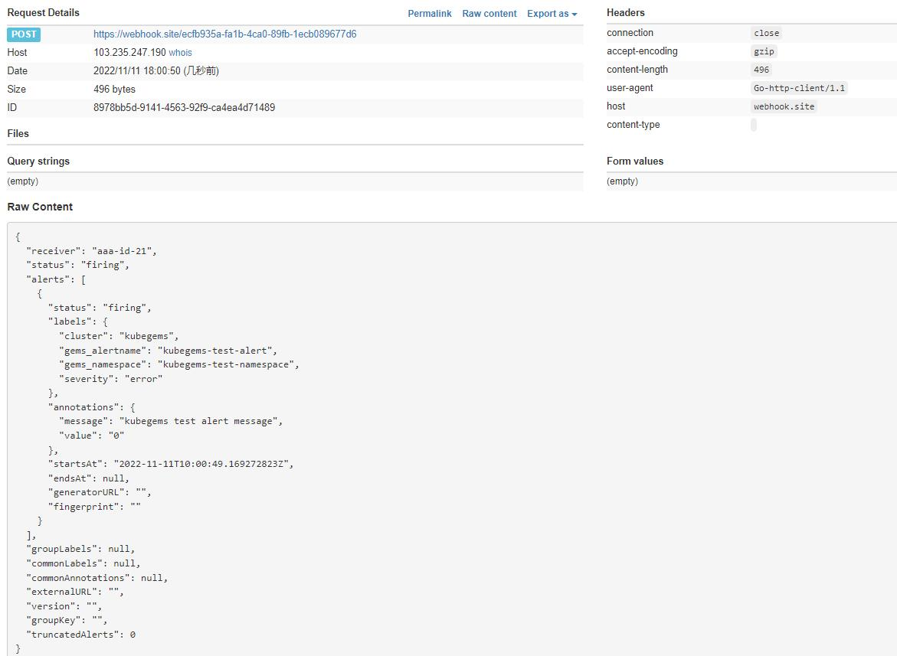

## 告警渠道

Kubegems告警支持在租户内配置告警渠道，用以分发日志/监控告警。目前支持的告警渠道有：
- `Email`: 邮件告警，使用配置的SMTP邮件服务器像目标邮箱发送告警
- `Webhook`: webhook告警，向目标webhook地址发送http的post请求，发送告警内容
- `飞书`: 飞书机器人告警，向目标飞书机器人发送告警
:::caution 注意
`kubegems-default-webhook`是平台内置的默认告警渠道，每个租户都可以使用，kubegems会在每条监控/日志告警规则中添加该告警渠道。它会把接收到的告警以平台内部消息的形式分发给每个 **环境用户**，若是系统级告警，则会分发给 **系统管理员**，你无法删除，也建议**不要对他进行修改**。
:::
### 添加告警渠道

1. 点击左上角，选择**可观测性**
2. 在可观测性栏目，选择**配置中心-告警渠道**

3. 点击**添加告警渠道**
4. 填写你的`告警渠道名称`及选择想添加的告警渠道类型
5. 你可以点击`测试`以测试该告警渠道是否畅通

#### Email 邮件告警

| 字段名         | 释义                                                           |
| :------------- | :------------------------------------------------------------- |
| 名称           | 告警渠道名                                                     |
| SMTP服务器     | SMTP服务器地址                                                 |
| 端口           | 使用SMTP服务器哪个端口发送邮件, 默认`25`                       |
| TLS            | 是否要求SMTP服务器启用TLS, 默认`false`                         |
| 发件人邮箱     | 发件人邮箱                                                     |
| 发件人邮箱密码 | 发件人邮箱密码                                                 |
| 收件人         | 收件人邮箱，从当前租户的用户邮箱中选择，也可以手动输入，可多选 |

:::tip 小知识
SMTP协议有多种用户认证方式，如：`CRAM-MD5`, `LOGIN`和`PLAIN`，我们支持的是 `LOGIN`和`PLAIN`
:::

若测试邮件告警成功，你会收到类似如下图的邮件:

#### 飞书机器人告警
首先你得在目标飞书群聊中，添加一个**自定义机器人**
:::tip 如何添加、使用飞书自定义机器人？
https://open.feishu.cn/document/ukTMukTMukTM/ucTM5YjL3ETO24yNxkjN?lang=zh-CN
:::

然后添加飞书告警渠道

| 字段名   | 释义                                                                 |
| :------- | :------------------------------------------------------------------- |
| 名称     | 告警渠道名                                                           |
| URL      | 飞书机器人地址                                                       |
| 用户id   | 要`@`的用户id，所有人为`all`                                         |
| 校验签名 | 若在飞书机器人处配置了`签名校验`，需要在这里填写飞书生成的签名字符串 |

若测试飞书机器人告警成功，你会收到类似如下图的消息:

#### Webhook告警
webhook告警渠道在触发告警时，会以`prometheus alertmanager`的告警格式，通过`HTTP POST`请求发送告警

| 字段名       | 释义                                                 |
| :----------- | :--------------------------------------------------- |
| 名称         | 告警渠道名                                           |
| URL          | webhook地址                                          |
| 跳过安全校验 | 是否跳过http安全校验，也就是是否`insecureSkipVerify` |

若测试webhook告警成功，你会收到类似如下图的消息:

### 修改、删除告警渠道
:::caution 注意
若一个告警渠道正在被某些告警规则使用，修改此告警渠道 **不会同步更新** 这些告警规则的接收器，此时会造成 **数据不一致**（但不影响该告警规则正常运行）。
此时建议在界面上根据提示，在数据不一致的地方重新提交修改该告警规则。

同理，删除该告警渠道也不会影响使用它的告警规则，但会造成数据不一致，最好重新提交告警规则。
:::
