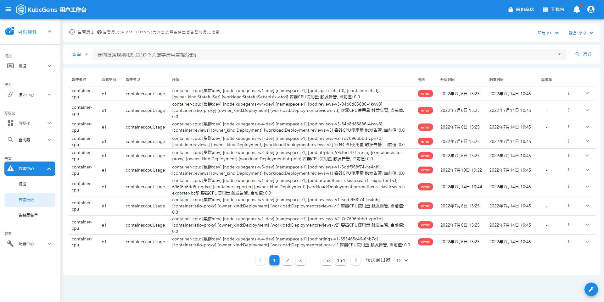
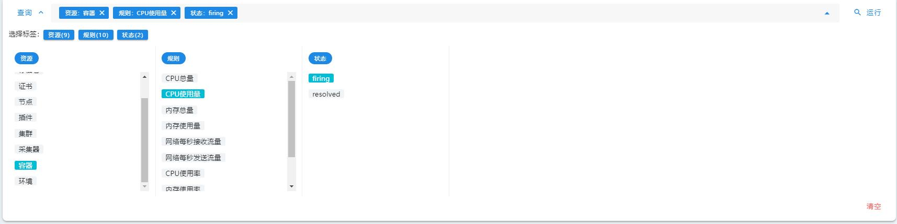
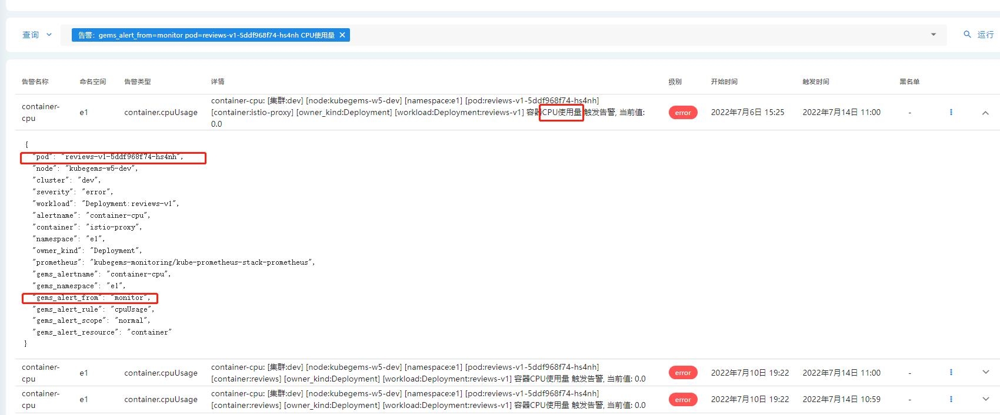

## 告警历史

Kubegems将所有告警规则**近30天**触发的告警消息都保存了一份副本，在告警历史搜索中，你可以结合多种查询方式搜索到你想要的告警消息。

### 告警历史查询

1. 点击左上角，选择**可观测性**
2. 在可观测性栏目，选择**告警中心-告警历史**
3. 在右上角选择对应的项目-环境

:::tip 小知识
每次告警触发会产生不止一条告警消息，它有自己的生命周期。
触发后会根据你配置的发送间隔每隔一段时间发送一条消息，在告警不再触发（被解决）的时候，还会产生一条状态为`resolved`的告警消息。

所以告警消息有三种时间：
- **开始时间**：告警初次触发时间
- **触发时间**：触发此次告警的时间，也可以理解为收到这条告警的时间
- **结束时间**：告警被解决的时间，只有状态为`resolved`的告警消息才有此时间
:::

4. 通过模板查询

如果你的告警规则是通过模板配置，你可以通过筛选模板的方式进行查询

5. 通过状态查询

告警消息有两种状态:

- `firing`: 正在告警中
- `resolved`: 该次告警已被解决

你也可以通过状态查询

6. 模糊查询

你可以直接输入查询表达式进行查询，表达式支持标签及内容查询。

- 对于标签，以`label_name=label_value`的形式查询。
- 对于内容，直接输入要搜索的告警消息内容即可。
- 若有多个搜索条件，中间以空格分开。

例：`gems_alert_from=monitor pod=reviews-v1-5ddf968f74-hs4nh CPU使用量`, 就是搜索标签中有`gems_alert_from=monitor` 和`pod=reviews-v1-5ddf968f74-hs4nh`且告警消息中有`CPU使用量`的告警消息

7. 加入/移除黑名单
点击每条告警右边的菜单栏，可选择把该告警加入或移除黑名单。

:::caution 注意
黑名单是根据告警消息的 **标签集** 管理的，也就是说：**把一条告警消息加入黑名单，所有跟他有相同标签的告警消息也会被加入黑名单**
:::