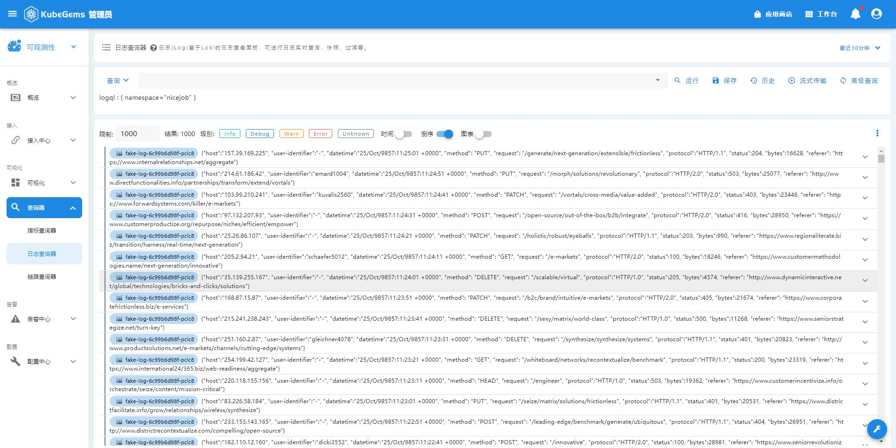
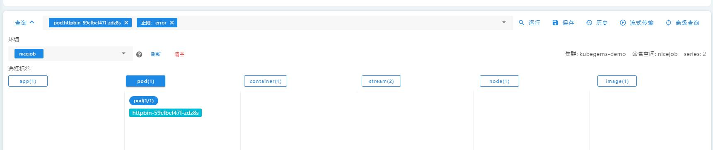
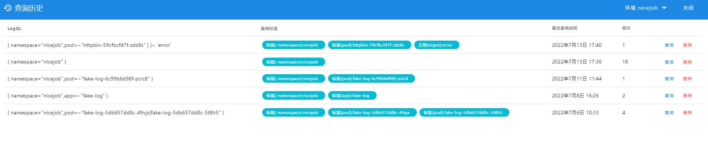

## 日志查询

查询采集到的容器日志，支持项目-环境、时间筛选及针对日志内容的正则匹配。

### 日志查询器

1. 点击左上角，选择**可观测性**
2. 在可观测性栏目，选择**查询器-日志查询器**
3. 选择对应的项目-环境后，点击**运行**

4. 选择标签
标签解释：
- app: pod的app label
- pod: pod名
- container：容器名
- stream：日志流类型，分为stdout和stderr
- node: pod所在节点
- image: 容器镜像名

5. 输入向查询的日志内容
日志内容支持正则表达式

6. 高级查询
也就是直接使用logql查询，logql 语法参见 https://grafana.com/docs/loki/latest/logql

7. 保存与使用查询历史
查询出结果后可以保存当前查询参数，然后在 **历史** 处选择。

8. 日志上下文
查询出结果后，可以在每条日志处点击 **显示上下文** 以查看该条日志的上下文日志。

9. 与监控联动
在每条日志处，可以点击如下图标，以查询该行日志时间点的该日至的源容器的CPU、内存、网络指标。
通过日志监控联动查询，以便更好地分析业务运行状态。

