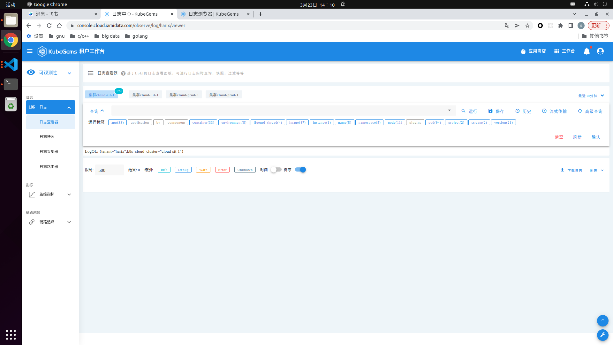
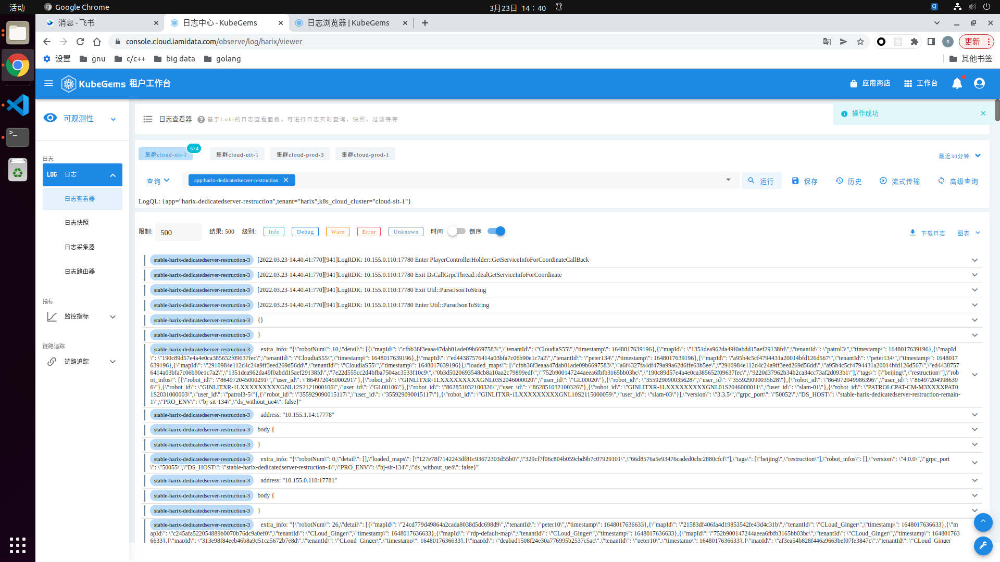

## 日志浏览器
  点击`可观测性`->`日志`->`日志查看器`, 进入日志查询界面, 
  选择特定集群比如`cloud-sit-1`,这时可以点击`查询`展开标签窗口  

  可以看到标签可以基于多个维度进行查询,比如app名称,名字空间,容器名称,pod名称等等  
  假如我现在想查询 `harix-dedicated-server` 这个应用的日志, 在标签中选择`app`,  
  然后输入框中输入`harix-dedi`前缀,会自动匹配出完整的名称,这时在右下角点击`确认`  

  然后点击`运行`得到最近30分钟的日志记录,可以看出,结果包含了应用所有的pod日志  

  