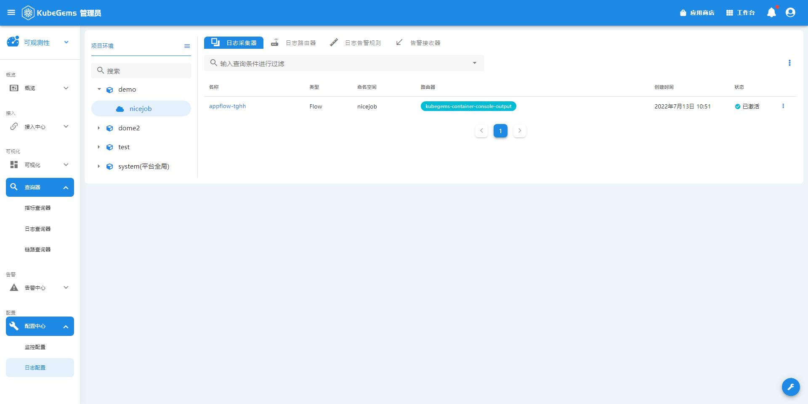
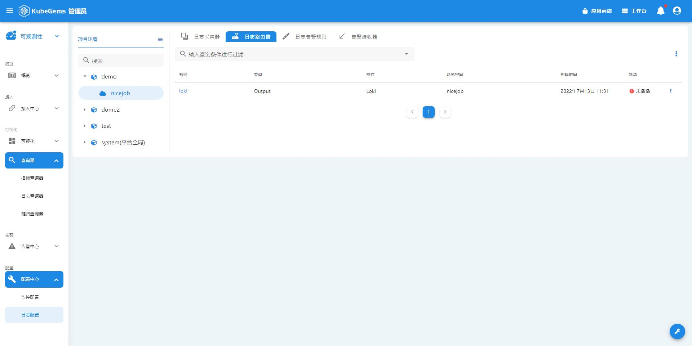

## 日志采集

通过配置 _日志采集器_ 与 _日志路由器_，Kubegems平台会将采集到的容器日志通过一系列标签、索引后持久化，然后在 _日志查询器_ 中统一查询。

### 日志采集器

日志采集用以采集容器日志，目前只支持采集容器**控制台日志**。

在采集时，我们支持一些过滤器：
- 限流：限制日志速率，超过指定速率则所有采集到的日志会被丢弃
- 监控：配置prometheus指标以记录该采集器的日志数量，该指标会被`fluentd`以exporter的形式被prometheus采集

1. 点击左上角，选择**可观测性**
2. 在可观测性栏目，选择**配置中心-日志配置**
3. 选择对应的项目-环境后，点击**日志采集**

### 日志路由器

日志路由器用以将对应采集器的日志，路由到指定的存储/中间件，我们支持:

- Loki
- Kafka
- Elasticsearch

1. 点击左上角，选择**可观测性**
2. 在可观测性栏目，选择**配置中心-监控配置**
3. 选择对应的项目-环境后，点击**日志路由器**

:::tip 小知识
日志路由器分为两种:
- `Output`: 仅能路由当前namespace中日志采集器的日志
- `ClusterOutput`: 能路由所有namespace中日志采集器的日志，但`ClusterOutput`只能在system(平台全局)空间中由管理员创建,kubegems内置了默认的`kubegems-container-console-output`, 你可以通过它将日志发送到`loki`
:::

