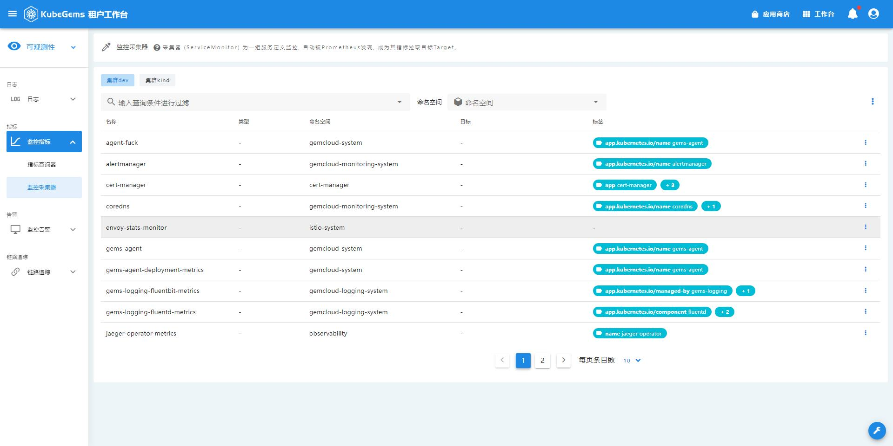

## 指标采集

Kubegems提供了针对`service`和`workload`的监控指标采集器功能，用户可为自己的应用配置对应的采集器，采集到的指标会汇集在该集群内置的`prometheus`中。

### 创建监控采集器

1. 点击右上角，选择**可观测性**
2. 在可观测性栏目，选择**监控指标**
3. 选择**监控采集器**



4. 右上角点击**创建采集器**


字段及释义:

| 字段名       | 释义                                                                                                                                                                                                             |
| :----------- | :--------------------------------------------------------------------------------------------------------------------------------------------------------------------------------------------------------------- |
| 名称         | 采集器名                                                                                                                                                                                                         |
| 命名空间     | 采集器所在的命名空间                                                                                                                                                                                             |
| 类型         | 要采集目标的类型，支持四种: `service`, `deployment`, `statefulset`, `daemonset`, 后面三种都算是`workload`                                                                                                        |
| 目标命名空间 | 要采集目标所在的命名空间，通常与命名空间相同                                                                                                                                                                     |
| 目标         | 要采集的目标名                                                                                                                                                                                                   |
| 标签配置     | 要采集目标的标签，通常会根据用户所选目标自动填充，用户也可以修改。默认填充方式根据采集器类型也会有所不同, 标签来自于 [标签来源](#标签来源)                                                                       |
| 端口         | 采集目标的端口名，端口来自于 [端口来源](#端口来源)                                                                                                                                                               |
| 路径         | 在所配置端口上的URL 路径，默认为 `/metrics`                                                                                                                                                                      |
| 采集间隔     | 多久采集一次，例如: `30s`, `1m`                                                                                                                                                                                  |
| 指标标签优先 | 若采集到的标签和 [Kubegems平台relabel的标签](#Kubegems平台relabel的标签) 重名，是否采集到的指标标签优先，更多信息参考: <https://prometheus.io/docs/prometheus/latest/configuration/configuration/#scrape_config> |

#### 标签来源

- `service`: 取metadata.labels字段
- `deployment/statefulset/daemonset`：取spec.template.metadata.labels字段

#### 端口来源

- `service`: spec.ports的所有name
- `deployment/statefulset/daemonset`: spec.template.spec.containers中，所有container的所有ports的name

#### Kubegems平台relabel的标签

在采集到指标时，平台会进行一系列的 _relabel_ 工作，通过relabel会给指标添加额外的标签，如下:
- `service`: job, container, endpoint, instance, namespace, pod, service
- `deployment/statefulset/daemonset`：job, container, endpoint, instance, namespace, pod

relabel规则大致如下:
```yaml
  relabel_configs:
  - source_labels: [job]
    separator: ;
    regex: (.*)
    target_label: __tmp_prometheus_job_name
    replacement: $1
    action: replace
  - source_labels: [__meta_kubernetes_service_label_name]
    separator: ;
    regex: nginx-ingress-operator
    replacement: $1
    action: keep
  - source_labels: [__meta_kubernetes_endpoint_address_target_kind, __meta_kubernetes_endpoint_address_target_name]
    separator: ;
    regex: Node;(.*)
    target_label: node
    replacement: ${1}
    action: replace
  - source_labels: [__meta_kubernetes_endpoint_address_target_kind, __meta_kubernetes_endpoint_address_target_name]
    separator: ;
    regex: Pod;(.*)
    target_label: pod
    replacement: ${1}
    action: replace
  - source_labels: [__meta_kubernetes_namespace]
    separator: ;
    regex: (.*)
    target_label: namespace
    replacement: $1
    action: replace
  - source_labels: [__meta_kubernetes_service_name]
    separator: ;
    regex: (.*)
    target_label: service
    replacement: $1
    action: replace
  - source_labels: [__meta_kubernetes_pod_name]
    separator: ;
    regex: (.*)
    target_label: pod
    replacement: $1
    action: replace
  - source_labels: [__meta_kubernetes_pod_container_name]
    separator: ;
    regex: (.*)
    target_label: container
    replacement: $1
    action: replace
```


5. 验证监控采集器

访问该集群的 <http://prometheus.gemcloud-monitoring-system:9090/targets> 验证是否成功采集


## 指标查询

在可观测性中，我们提供了一系列的监控查询模板，便于用户实时查询自己关心的监控指标，并绘制出对应的时序图。


### 配置查询模板

Kubegems配置Prometheus的查询模板，用以简便、优雅地进行指标查询及告警规则配置

1. 点击右下角工具箱按钮，进入**平台管理**
:::tip 提示
只有**系统管理员**用户才能进入**平台管理**
:::

2. 展开左下角**集成**菜单栏
3. 选择**Promethus模板**


4. 可以选择创建、编辑、删除模板，模板构成如下:


模板释义:

| 模板构成 | 释义                                                           |
| :------- | :------------------------------------------------------------- |
| 类型     | 模板所属模块，按是否有`namespace`属性区分                      |
| 名称     | 模板名                                                         |
| 规则     | 与模板名对应，中文释义，查询和告警时会展示                     |
| expr     | 对应的`promql`表达式，查询`prometheus`时会执行改查询语句       |
| 单位     | 该条规则支持的单位`key`, 具体参见 [单位表](#单位表)            |
| 标签     | 该`promql`支持筛选的标签，配置后可以在查询、告警时进行标签筛选 |

:::tip 提示
在编辑、删除模板时，要注意检查模板有没有被告警规则引用，当然，被引用了的模板是无法删除的
:::

### 查询出图

1. 点击左上角菜单栏，进入**可观测性**
2. 点击侧边栏**监控指标**
3. 选择**指标查询器**
4. 填写你想查的参数，并执行查询:


| 参数名   | 释义                                                                                 |
| :------- | :----------------------------------------------------------------------------------- |
| 集群     | 查询哪个集群的指标（只有 **管理员** 才会选）                                         |
| 项目环境 | 查询的目标项目、环境，会根据用户当前租户进行筛选                                     |
| 资源规则 | 也就是选择查询的模板及单位，普通用户只能查询有`namespace`属性的模板                  |
| Topk     | 指promtheus的`topk`函数, 展示数组最大的`k`组指标，避免数据过多影响界面查看，默认`20` |
| Step     | 时序图的时间间隔，用以控制返回的样本密度，默认`auto`，也就是按查询的时间范围自适应   |
| 起止时间 | 时序图的时间范围，默认最近30分钟                                                     |

:::tip 小知识
Topk、Step、起止时间 作用于当前界面的所有查询面板
:::

5. 查询出图后，可选择标签，筛选出你关心的指标
6. 点击添加查询，支持同时查询多个指标并出图

:::tip 小技巧
每个面板右上角有 **设置告警** 按钮，点击可以通过当前面板的参数快捷创建告警规则，详见 **告警规则** 相关文档
:::


#### 单位表

| key     | value |
| ------- | ----- |
| percent | %     |
| core    | 核    |
| mcore   | 毫核  |
| b       | B     |
| kb      | KB    |
| mb      | MB    |
| gb      | GB    |
| tb      | TB    |
| bps     | B/s   |
| kbps    | KB/s  |
| mbps    | MB/s  |
| ops     | 次/s  |
| count   | 个    |
| times   | 次    |
| us      | 微秒  |
| ms      | 毫秒  |
| s       | 秒    |
| m       | 分钟  |
| h       | 小时  |
| d       | 天    |
| w       | 周    |
