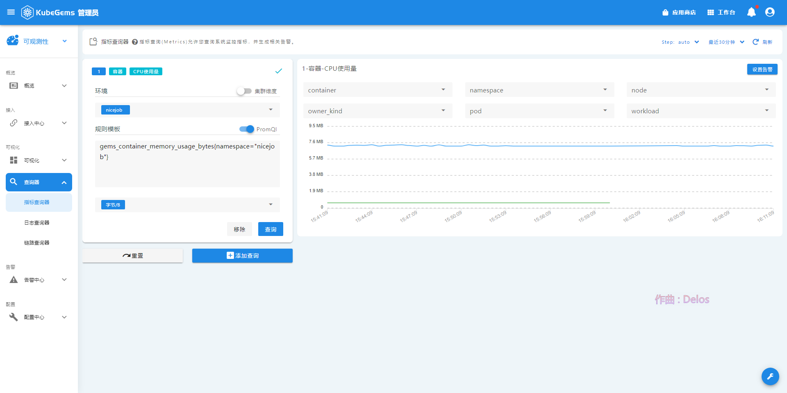
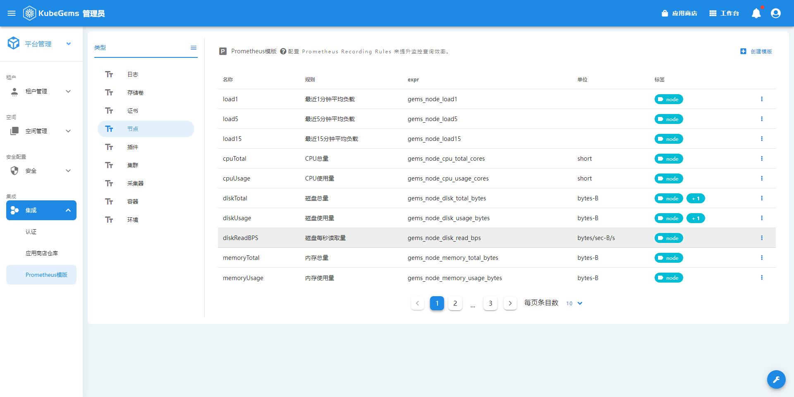
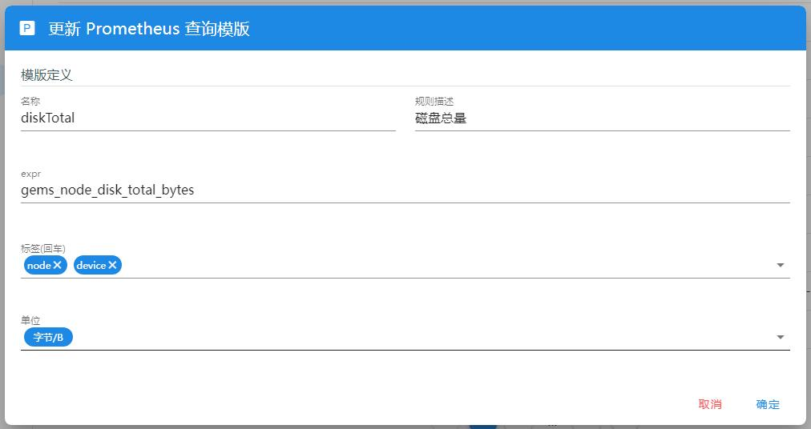

## 指标查询

在可观测性中，我们提供了基于内置监控模板与原生promql的监控指标查询器功能。

### 查询出图

1. 点击左上角，选择**可观测性**
2. 在可观测性栏目，选择**查询器-指标查询器**
3. 填写你想查的参数，并执行查询:

| 参数名   | 释义                                                                                                          |
| :------- | :------------------------------------------------------------------------------------------------------------ |
| 集群     | 查询哪个集群的指标（只有 **管理员** 才会选），此时无需指定要查询的环境/namespace                              |
| 环境     | 查询的目标项目、环境，会根据用户当前租户进行筛选                                                              |
| 规则模板 | 使用内置的监控查询模板查询(与查询语句互斥)，模板来自[Prometheus模板](#prometheus模板)                         |
| 查询语句 | 使用原生的promql查询(与规则模板互斥)，普通用户在查询时必须加上所选环境的namespace标签如`{namespace="test"}`   |
| 单位     | 在使用promql查询时，你可以为你的查询结果指定单位，这样我们的图表就能根据它做单位自适应，详见[单位表](#单位表) |
| Topk     | 指promtheus的`topk`函数, 展示数组最大的`k`组指标，避免数据过多影响界面查看，默认`20`                          |
| Step     | 时序图的时间间隔，用以控制返回的样本密度，默认`auto`，也就是按查询的时间范围自适应                            |
| 起止时间 | 时序图的时间范围，默认最近30分钟                                                                              |

:::tip 小知识
Topk、Step、起止时间 作用于当前界面的所有查询面板。
:::

5. 在查询出图后，若你使用的是查询模板，你可以再对结果做标签筛选，筛选出你关心的指标
   

6. 点击添加查询，支持同时查询多个指标并出图

:::tip 小技巧
每个面板右上角有 **设置告警** 按钮，点击可以通过当前面板的参数快捷创建告警规则，详见 **告警规则** 相关文档
:::

### Prometheus模板

Kubegems配置Prometheus的查询模板，用以简便、优雅地进行指标查询及告警规则配置

4. 可以选择创建、编辑、删除模板，模板构成如下:

模板释义:

| 模板构成 | 释义                                                           |
| :------- | :------------------------------------------------------------- |
| 类型     | 模板所属模块，按是否有`namespace`属性区分                      |
| 名称     | 模板名                                                         |
| 规则     | 与模板名对应，中文释义，查询和告警时会展示                     |
| expr     | 对应的`promql`表达式，查询`prometheus`时会执行改查询语句       |
| 单位     | 该条规则支持的单位`key`, 具体参见 [单位表](#单位表)            |
| 标签     | 该`promql`支持筛选的标签，配置后可以在查询、告警时进行标签筛选 |

:::tip 提示
在编辑、删除模板时，要注意检查模板有没有被告警规则引用，当然，被引用了的模板是无法删除的
:::

### 单位表

目前支持的单位如下:

| 单位名          | 单位释义           |
| --------------- | ------------------ |
| short           | 默认(按1000做进制) |
| bytes-B         | 字节/B             |
| bytes-KB        | 字节/KB            |
| bytes-MB        | 字节/MB            |
| bytes-GB        | 字节/GB            |
| bytes-TB        | 字节/TB            |
| bytes-PB        | 字节/TB            |
| bytes/sec-B/s   | 字节速率/B/s       |
| bytes/sec-KB/s  | 字节速率/KB/s      |
| bytes/sec-MB/s  | 字节速率/MB/s      |
| bytes/sec-GB/s  | 字节速率/GB/s      |
| bytes/sec-TB/s  | 字节速率/TB/s      |
| bytes/sec-PB/s  | 字节速率/PB/s      |
| duration-ns     | 时间/ns            |
| duration-us     | 时间/us            |
| duration-ms     | 时间/ms            |
| duration-s      | 时间/s             |
| duration-m      | 时间/m             |
| duration-h      | 时间/h             |
| duration-d      | 时间/d             |
| duration-w      | 时间/w             |
| percent-0.0-1.0 | 百分比/0.0-1.0     |
| percent-0-100   | 百分比/0-100       |
| custom          | 自定义             |
