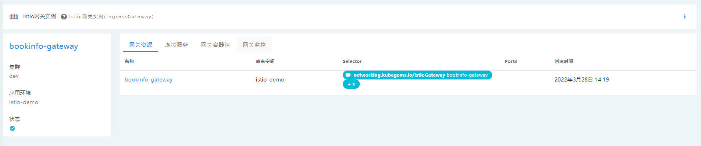

## 微服务网关
微服务与[租户网关](../user-operation/gateways/gateway.md)有些许不同，在基本属性上：

| 网关类型   | 代理实例      | 路由配置                           | 纳入服务网格 | 代理范围 |
| ---------- | ------------- | ---------------------------------- | ------------ | -------- |
| 微服务网关 | `istio-envoy` | istio `gateway+virtualservice` CRD | √            | 虚拟空间 |
| 租户网关   | `nginx`       | k8s `ingress` resource             | x            | 租户空间 |

在功能上：

| 网关类型   | 副本控制方式   | 是否支持非ssl的http2/grpc代理 |
| ---------- | -------------- | ----------------------------- |
| 微服务网关 | hpa 自动伸缩   | √                             |
| 租户网关   | 手动管理副本数 | x                             |

### 管理微服务网关

1. 点击左上角菜单栏，选择 **服务治理**
2. 在侧边栏找到 **空间配置**，点击 **微服务网关**

3. 创建微服务网关

创建时只需指定网关名


4. 创建网关代理策略

需要通过`gateway+virtualservice`资源来创建网关代理策略，eg. 
```yaml
apiVersion: networking.istio.io/v1alpha3
kind: Gateway
metadata:
  name: bookinfo-gateway
spec:
  selector:
    networking.kubegems.io/virtualspace: test
    networking.kubegems.io/istioGateway: bookinfo-gateway
  servers:
    - port:
        number: 80
        name: http
        protocol: HTTP
      hosts:
        - "*"
---
apiVersion: networking.istio.io/v1alpha3
kind: VirtualService
metadata:
  name: bookinfo
spec:
  hosts:
    - "*"
  gateways:
    - bookinfo-gateway
  http:
    - match:
        - uri:
            exact: /productpage
        - uri:
            prefix: /static
        - uri:
            exact: /login
        - uri:
            exact: /logout
        - uri:
            prefix: /api/v1/products
      route:
        - destination:
            host: productpage
            port:
              number: 9080
```            

5. 在网关详情页，你可以看到：
   
- 网关实例关联的`gateway`、`virtualservice`资源
- 网关实例 pod
- 网关监控信息: qps、响应时间

