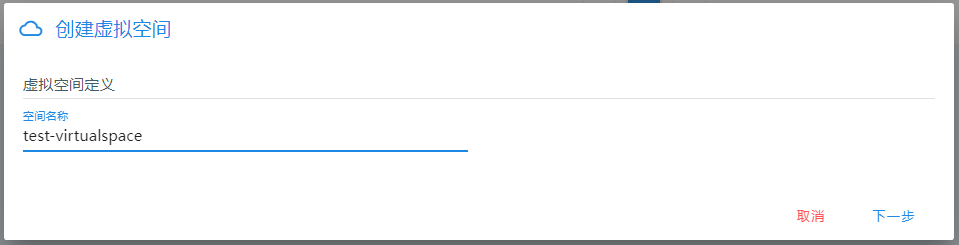
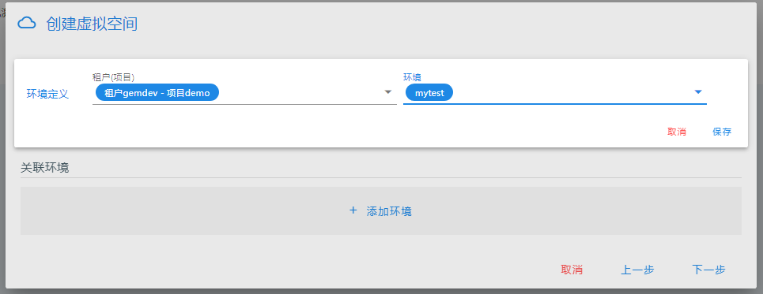
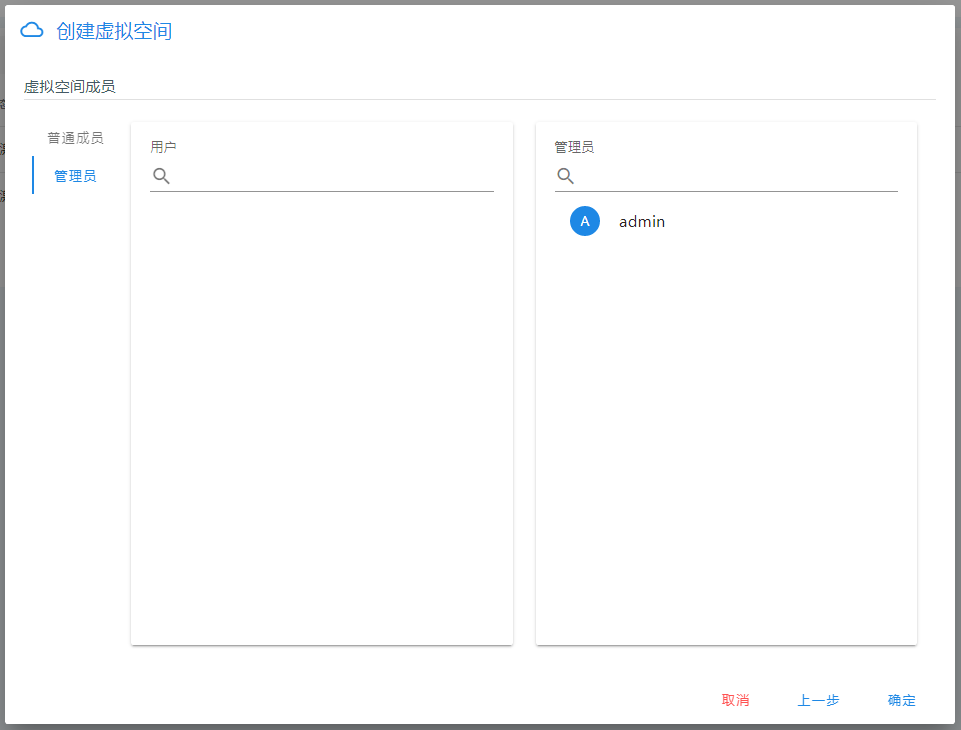

## 虚拟空间管理

**虚拟空间** 是针对微服务管理抽象出的虚拟概念，它是一组**环境**的集合，它可以跨租户、项目、集群，将一组环境纳入其中统一管理。

虚拟空间只能由系统管理员创建，之后维护工作可以由指定的`虚拟空间管理员`完成。

### 创建虚拟空间

1. 点击左上角菜单栏，选择**服务治理**
2. 在**微服务空间**中，点击**虚拟空间**
3. 点击**创建虚拟空间**

4. 指定名称，点击**下一步**

5. 选择要加入该虚拟空间的环境，可以添加多个

6. 选择要加入的用户，可加入的用户列表是所选环境的环境成员

7. 然后就可以进入该虚拟空间管理其中资源了

