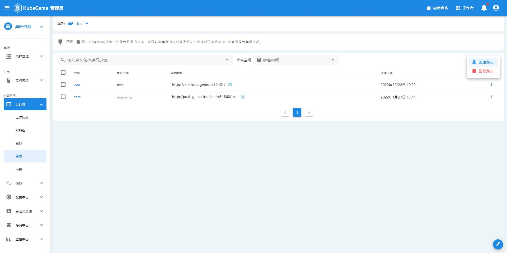

## 服务路由

Kubegems 针对租户网关功能，提供了相对便捷的ingress服务路由功能

### 绑定路由网关

1. 点击右上角**工作台**
2. 选择一个环境，点击**进入环境**
3. 在左侧边栏**运行时**，选择**路由**

4. 点击**创建路由**

| 字段名   | 释义                                                                                                                                                                                                                                                                                                                                                                                                                          |
| :------- | :---------------------------------------------------------------------------------------------------------------------------------------------------------------------------------------------------------------------------------------------------------------------------------------------------------------------------------------------------------------------------------------------------------------------------- |
| 名称     | 路由名                                                                                                                                                                                                                                                                                                                                                                                                                        |
| 声明网关 | 选择当前租户下已创建的网关，将该路由规则与其绑定, 当然，也可以选择默认网关。                                                                                                                                                                                                                                                                                                                                                  |
| 域名     | 该路由要代理的域名，可以随机生成，若不指定的话，也会根据其绑定网关的 **默认域名** 字段随机生成                                                                                                                                                                                                                                                                                                                                |
| 协议     | 代理协议,支持，详见 [路由规则协议](#路由规则协议)                                                                                                                                                                                                                                                                                                                                                                             |
| 密钥     | 根据协议选填，详见 [路由规则协议](#路由规则协议)                                                                                                                                                                                                                                                                                                                                                                              |
| 路径     | 要代理的 URL 路径                                                                                                                                                                                                                                                                                                                                                                                                             |
| 服务     | 代理的上游（目标）服务                                                                                                                                                                                                                                                                                                                                                                                                        |
| 端口     | 代理到上游服务的端口号                                                                                                                                                                                                                                                                                                                                                                                                        |
| 注解     | 支持以`key-value`形式配置注解，注解会作为`annotations`配置在`ingress`资源上，通常用于自定义或微调 NGINX 行为，例如，设置连接超时值。路由中配置的注解优先级**高于**网关中的注解，另外，根据你选择的协议，会自动在这里生成对应的注解，详见 [路由规则协议](#路由规则协议)。受支持的注解配置项参考文档：<https://docs.nginx.com/nginx-ingress-controller/configuration/ingress-resources/advanced-configuration-with-annotations> |

:::tip 小知识
路由绑定网关时，将路由的`spec.ingressClassName`字段设置为与网关的`spec.ingressClass`相同，即为绑定
:::

### 路由规则协议

| 协议  | 是否需要绑定密钥 | 对应的注解                                         |
| :---- | ---------------- | :------------------------------------------------- |
| http  | x                |
| https | √                |
| ws    | x                | `nginx.org/websocket-services: service1, service2` |
| wss   | √                | `nginx.org/websocket-services: service1, service2` |
| grpc  | √                | `nginx.org/grpc-services: service1, service2`      |

:::info 
你可以在 **[配置中心-密钥](/docs/tasks/user-operation/workerloads/config)** 模块创建密钥
:::

