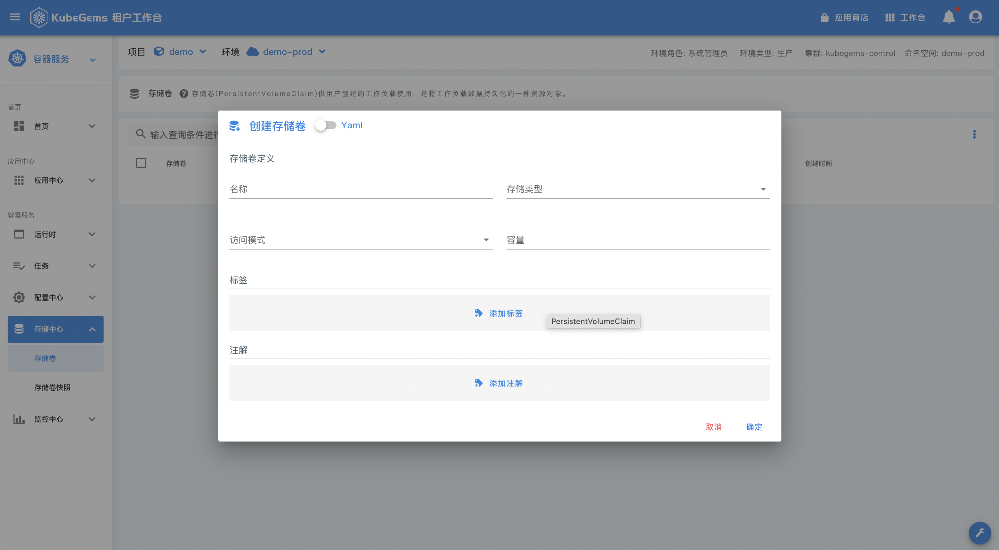
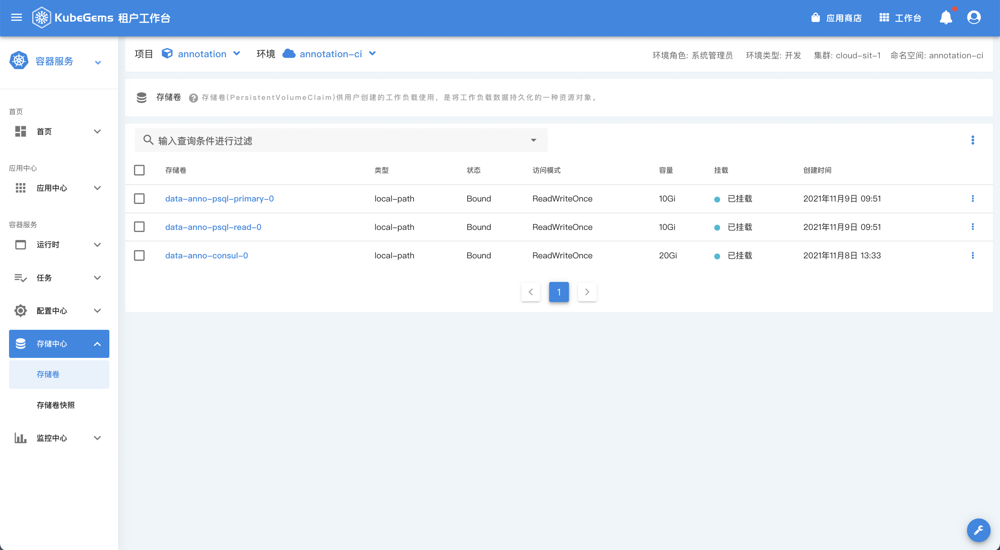

## 存储卷

`存储卷声明`是kubernetes提供的持久化存储的对象; 主要需要用户提供自己需要的`存储卷容量`和`存储类型`以及`读写模式`;

### 创建存储卷声明

|字段|说明|
|---|---|
|名字|卷声明的名字|
|存储类型|存储类型，即`StorageClasss`,每个集群的存储卷类型不同，他们的`能力`也可能不尽相同，这主要取决于对应存储类型`CSI`的`GetCapacity`返回的能力列表，例如是否支持快照|
|访问模式|同存储类型类似，这个字段根据对应的存储类型对CSI驱动的支持选择,[访问模式文档](https://kubernetes.io/zh/docs/concepts/storage/persistent-volumes/#access-modes)|
|容量|卷的存储容量大小|

### 存储卷声明列表

### 修改存储卷声明

和创建存储声明类似的是，能否修改存储卷的`容量`字段需要根据对应存储卷类型的`CSI`驱动是否支持动态扩容决定;