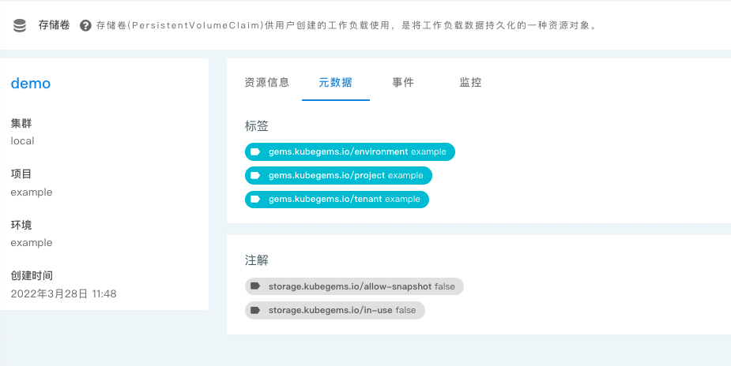
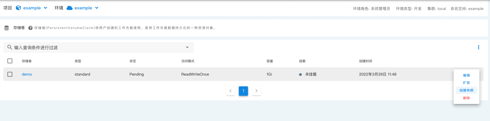
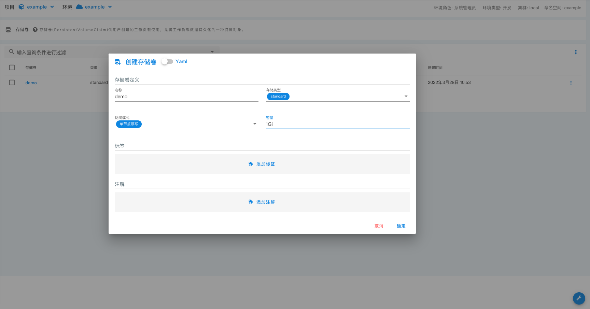

_存储卷_ 供用户创建的工作负载使用，是将工作负载数据持久化的一种资源对象。其对应的 k8s 资源为 [PersistentVolumeClaim](https://kubernetes.io/zh/docs/tasks/configure-pod-container/configure-persistent-volume-storage/#%E5%88%9B%E5%BB%BA-persistentvolumeclaim)

> 一般来说存储卷对应了 k8s 中的 PersistentVolume 资源，但是在 namespace 下，无法直接使用该资源，需要使用 PersistentVolumeClaim 来间接使用 PersistentVolume。
> 为了方便用户理解，在租户环境中使用 _存储卷_ 来表示 PersistentVolumeClaim。您无需关注 k8s 上如何实现，您仅需要知道 _存储卷_ 可以将您的数据持久化。

## 存储卷列表

存储卷列表中可以看见当前环境中存在的存储卷以及其使用状态。

此外，存储卷详情中会动态添加两个注解:

- `storage.kubegems.io/allow-snapshot` ,表示是否允许快照。值为 false 的存储卷无法使用 **快照** 功能。
- `storage.kubegems.io/in-use`,表示该存储卷是否正在使用。

允许快照的存储卷可以 **创建快照**

创建完成的快照可以在 [存储卷快照](snapshot) 中查看

## 创建存储卷

您可以预先创建一个存储卷：

| 字段     | 说明                                                                                                                                 |
| -------- | ------------------------------------------------------------------------------------------------------------------------------------ |
| 名称     | 存储卷名称，使用时根据该名称进行关联                                                                                                 |
| 存储类型 | 存储卷提供者类型                                                                                                                     |
| 访问模式 | 单节点读写，多节点只读，多节点读写 等，见[访问模式](https://kubernetes.io/zh/docs/concepts/storage/persistent-volumes/#access-modes) |
| 容量     | 存储卷容量                                                                                                                           |

## 存储卷扩容

在存储卷容量不足的情况下， 您可能需要进行存储卷扩容，但不是所有的存储卷类型都支持扩容，取决于其存储卷提供者。您可以在界面上进行操作，然后在详情中的 **事件** 中观察是否成功扩容。

## 删除存储卷

删除存储卷后，意味着您放弃了您的数据，删除存储卷后您一般无法再次找回您的数据。需要谨慎操作。
