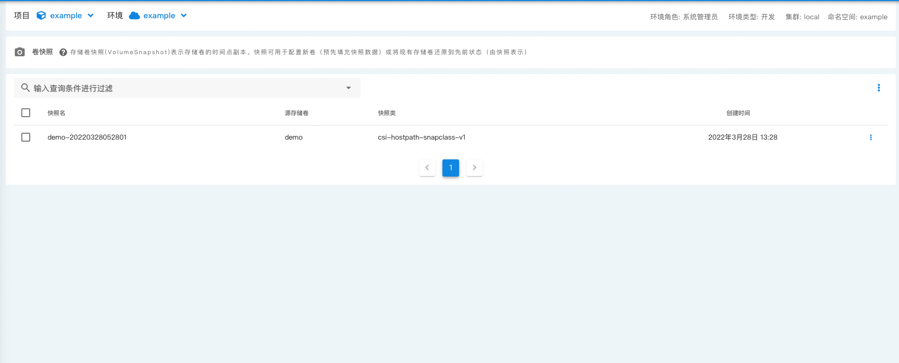
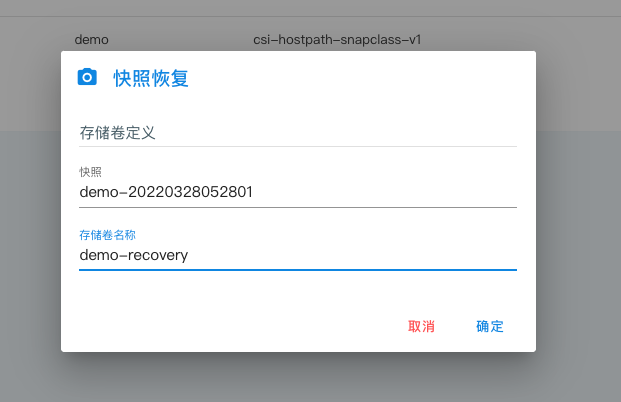

## 快照

_存储卷快照_ 是存储卷在某一时刻的完整备份，您可以通过存储卷快照恢复您的存储卷。

通常对于重要数据，都会选择定期对数据进行备份；`CSI`的`Capacity`提供了是否支持卷快照; kubegems 采用了外部快照的方案;

## 快照恢复

您可以从现有的快照创建一个新的 _存储卷_

| 字段       | 说明               |
| ---------- | ------------------ |
| 快照       | 快照名称           |
| 存储卷名称 | 恢复到的存储卷名称 |
