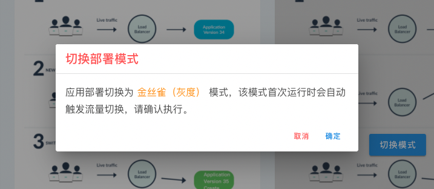
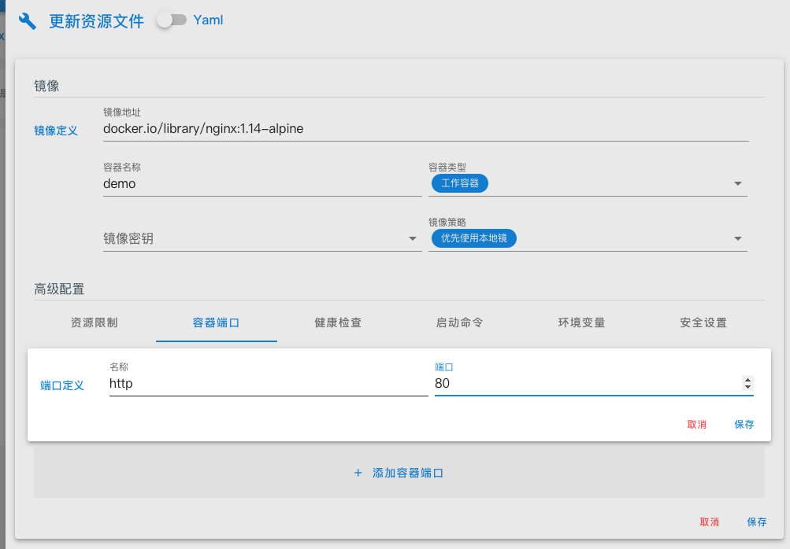
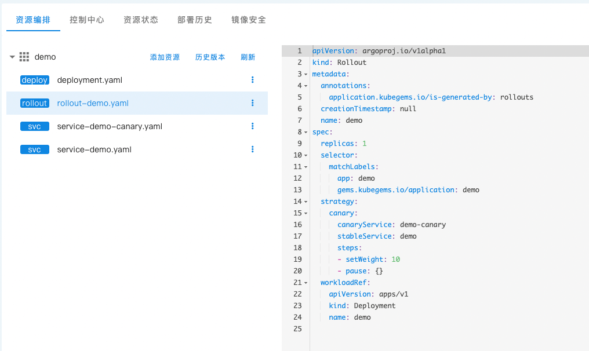
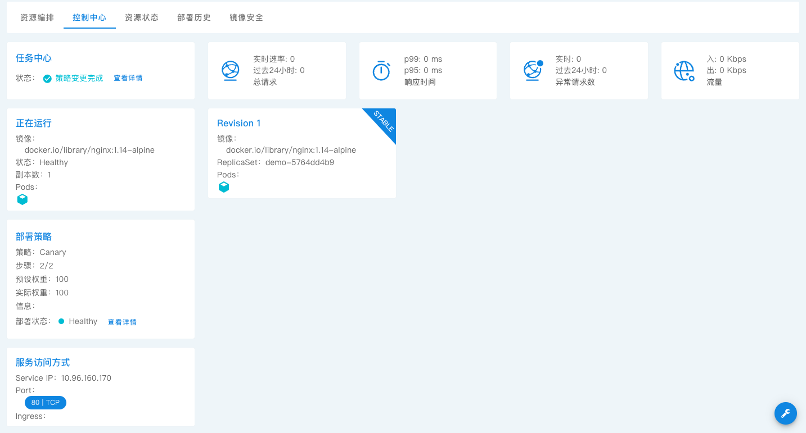
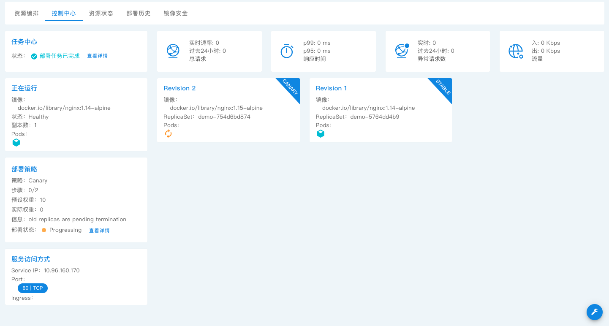
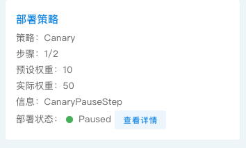
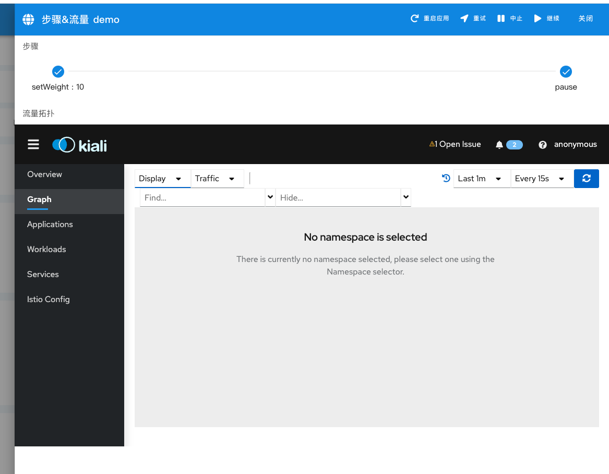
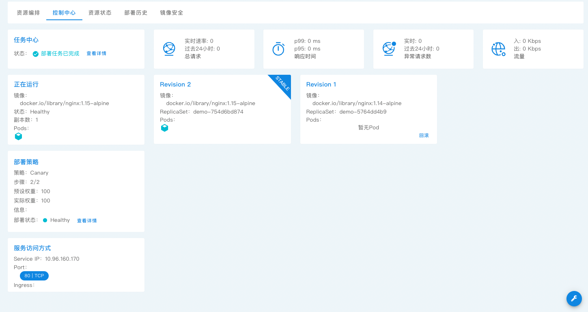

入口： 单击应用详情页面右上方按钮 **高级部署** 进入，如果没有该按钮，则为该部分插件未安装，需要先安装。

_高级部署_ 现在仅支持无状态服务（Deployment）.

## 部署策略

高级部署支持以下策略：

- 滚动更新（RollingUpdate），
- 重建（Recreate），
- 蓝绿发布（Blugreen），
- 金丝雀(灰度)发布（Canary），

在这四种策略中，使用 Deployment 实现 滚动更新和重建 策略；使用 [argo-rollouts](https://argoproj.github.io/argo-rollouts) Rollout 实现蓝绿发布和灰度发布。

在这两类策略切换时，由于 workload 会在 Deployment 和 Rollout 中切换，会导致流量切换。
确认切换后需要等待 Rollout 准备完成后才能继续操作，Rollout 会启动与 Deployment 相同数量的 Pod 并在启动完成后将流量切换至 Rollout 管理的 Pod。
对于 grpc 等长链接服务可能出现短暂中断。

如果您的应用没有 Service 或者没有指定任何一个端口，则会切换失败，您需要先在编排中至少为您的应用指定一个端口，系统会自动根据该端口生成 Service。

在确认切换至 蓝绿发布/灰度发布 （Rollout） 后，会在编排中增加一些和 Rollout 相关的资源，通常您无需关注这些资源；

准备完成后可以返回 **控制中心** 看到左下侧的 **部署策略** 更新为了 `Canary`,在当前版本上会增加 `Stable` 标记。

再次进入 **高级部署** 后即可使用 蓝绿发布/灰度发布 功能了。以灰度发布（Canary）为例：

你需要选择新版本的镜像 tag ，版本号,

| 字段         | 说明                                                                                                           |
| ------------ | -------------------------------------------------------------------------------------------------------------- |
| tag          | 新版本镜像 tag                                                                                                 |
| 版本号       | 新版本号 ，一般为 v1 v2 v1.1 等有语义化版本号，通过这个版本来区分不同流量                                      |
| 流量路由     | `默认`，通过控制新旧副本数量比例来进行灰度，粗粒度。 `istio网关` 借用 istio 来进行流量路由，细粒度，依赖 istio |
| 灰度流量比例 | 初始化时的流向新版本（灰度版本）的流量比例                                                                     |

确认发布之后，会跳转至 **控制中心** 页面。

此时会有两个版本被标记为 `Canary` 和 `Stable`，分别为 灰度版本 和 当前版本。

等待新版本 Pod 完全准备完成后，此时您可以测试验证灰度版本是否正常，您需要单击 **查看详情** 查看实时请求统计。

在本页面中可以根据灰度版本的效果进行对应操作：

- **重启应用** :删除灰度版本的 Pod 并让其重新创建。
- **重试** : 重新开始灰度流程。由于默认的灰度流程仅有 2 个步骤，该操作无明显效果。
- **中止** : 将暂停灰度流程，将所有流量保持在旧版本。
- **继续** : 将执行下一步操作。默认情况下为将流量全部切换至新版本上。

单击 **继续** 后,可以看到所有流量已经切换到新版本上，原来 `Canary` 的版本被标记为了 `Stable` 。

