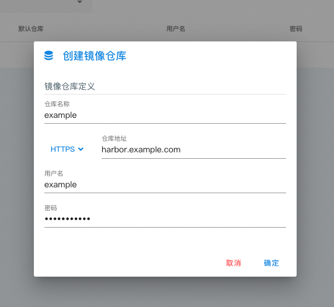

镜像仓库中管理了所使用的到的镜像仓库连接信息，这些信息的存在为您提供包含 镜像tag联想，[镜像安全](orchestration#镜像安全) 以及运行时自动填充 imagePullSecret 等功能。

## 列表页

列表页面展示了当前项目下所有的镜像仓库

**置为默认仓库** 功能可以选择一个镜像仓库设置为默认仓库。
默认仓库会在该项目所有环境下创建同名的类型为 `dockerregistry` 的 _Secret_ 并将 default _ServiceAccount_ 的 `imagePullSecret` 字段设置为该 _Secret_

## 创建镜像仓库

点击右侧下拉菜单栏 **⋮** - **创建镜像仓库** ：

## 删除镜像仓库

选择对于镜像仓库右侧菜单 **⋮** - **删除** 以删除镜像仓库。
