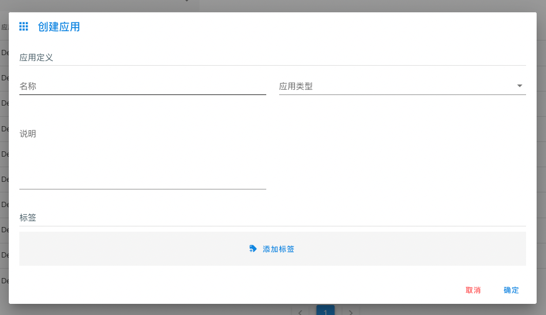
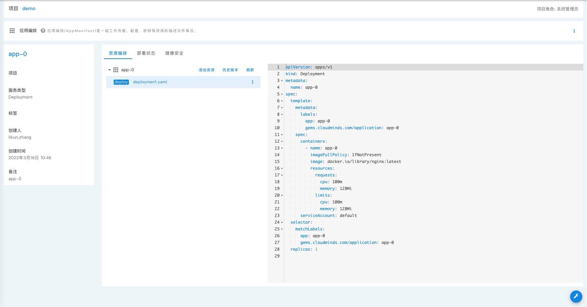

入口： **租户工作台** - **项目** 页面，点击左侧下拉菜单 **应用中心** - **应用编排** 按钮。

**应用编排** 是各项目下发布 _用户应用_ 的唯一方式，用户在应用编排中完成编辑后，可以在环境中使用**关联应用**将其同步到环境中成为_用户应用_。

_应用编排_ 为一组工作负载，配置，密钥等资源的描述文件集合。**应用编排** 中提供了对这些描述文件的便捷界面以帮助您快速完成编辑。

_应用编排_ 存储于内置的`git`服务上，可以非常方便的进行版本管理，例如 **历史版本** ，**回滚**等。此外还提供一些其他的相关操作。

_应用编排_ 存储文件结构为 [kustomize][kustomize] 格式，包含一个 `kustomization.yaml` 以及多个资源文件,
`kustomization.yaml` 文件目前不展示在页面上，且其内容由后端动态维护。

_资源_ 为 Kubernetes 中的对象(resource)，通常是一个 `yaml` 格式的文件。

## 列表页

应用编排列表页提供所在项目的 _应用编排_ 查询，您可以通过页面下方的分页按钮切换多页，还可以使用左上方的搜索框进行名称模糊搜索。

## 创建应用

**创建应用** 用于创建一个_应用编排_ :

| 字段名     | 释义                                                                         |
| ---------- | ---------------------------------------------------------------------------- |
| `名称`     | 应用名称，作为主要的工作负载名称。                                           |
| `应用类型` | `无状态服务`：Deployment `有状态服务`:StatefulSet `守护进程服务`：DaemonSet  |
| `说明`     | 应用描述信息                                                                 |
| `标签`     | KV 格式的标签，其会作为`kustomize`的 [commonLabels][kustomize-common-labels] |

[kustomize]: https://github.com/kubernetes-sigs/kustomize
[kustomize-common-labels]: https://kubectl.docs.kubernetes.io/references/kustomize/builtins/#_labeltransformer_

创建应用完成后，可以在列表页点击应用名称进入应用编排页。

## 编排应用

编排页面提供 **资源编排** **部署历史** **镜像安全** 功能

### 资源编排

**资源编排** 页面展示了当前的资源文件,对于新创建的应用编排，默认添加了一个最小化的对应应用类型的资源文件。您从这里开始完善您的应用。

**添加资源** 用于添加新的资源定义，我们对常用的资源类型提供了可视化的编辑界面，若需要编排其他类型，可以将添加资源页面上方的 **Yaml** 开关打开来手动编辑。

支持的常用资源类型：

| 类型       | 资源类型             | 释义                                        |
| ---------- | -------------------- | ------------------------------------------- |
| 服务       | Service              |
| 配置       | ConfigMap            |
| 密钥       | Secret               |
| 存储卷     | PersistenVolumeClaim |
| 任务       | Job                  |
| 定时任务   | CronJob              |
| 路由       | Ingress              |
| 无状态服务 | Service              | Headless Service, 没有 ClusterIP 的 service |

**历史版本** 可以查看资源的变更记录，还可以通过对应记录右侧的菜单栏查看 **变更内容** 和 **回滚** 操作。

**历史版本** - **变更内容** 允许您查看改编排的编辑变动内容。

**历史版本** - **回滚** 操作会将您当前的编排所有内容设置为需要回滚到的版本。

**刷新** 操作用于手动从`git`服务器更新编排内容。由于某些异步操作，导致实际内容已经发生了变更，您一般情况下无需执行该操作。

### 部署状态

部署状态 页面可以看见该编排被部署到的所有 环境 和 实时状态，发布时间等。

### 镜像安全

镜像安全页面提供了对当前编排中使用到的镜像的安全扫描结果，以及可以对镜像设置为 **不可发布** 状态，处于此状态的镜像无法在 **部署应用** 时使用。

**NOTE**: 由于镜像的安全报告需要从镜像仓库获取(目前仅支持harbor仓库)，在使用该功能前，您需要在 **应用中心** - **[镜像仓库](image-registry)** 下添加仓库配置，
系统才能够正确的从镜像仓库获取镜像的安全报告。
