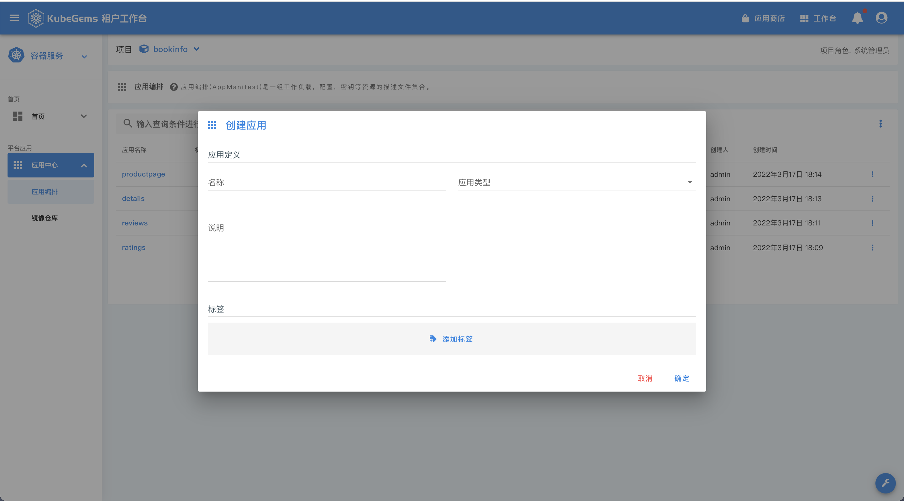

## 用户应用

除了应用商店的应用，剩下的都应该是用户自己的应用，kubegems提供了用户应用管理的功能；

:::caution
通常情况下，应用有多个环境，同一个应用在不同的环境下，由于环境的基础设施不同，编排文件或许存在一些差异，但大部分的内容都相似；针对这样的情况， kubegems 的策略是`在项目下维护应用的模版，在环境下维护应用的实际编排`，即 在`项目`的应用中心维护的是应用的基础模版，它不会真实部署，只有将它和`环境`关联的时候，它才会部署到对应的环境中; 关联到具体环境之后，用户可以针对差异的部分进行再次编辑，编辑之后的编排文件仅对当前环境生效；
:::

### 创建应用模版

1. 创建应用

|字段|说明|
|---|---|
|应用名称|应用的名字，唯一|
|应用类型|Deployment StatefulSet DaemonSet 其中之一|
|说明|应用简介|

2. 编辑资源

kubegems 提供了简单的表单支持编辑workload，如果有复杂的需求，可以切换为yaml模式
caution

除了默认添加的资源，用户还可以添加`服务(Service)` `配置(ConfigMap)` `密钥(Secret)` `存储卷(PersistVolumnClaim)` `任务(Job)` `定时任务(CronJob)`这些资源到应用的编排定义中;

### 编辑环境下的应用

编辑环境下的应用和编辑项目下的应用模版操作一样，只是环境下的应用关联的是真实环境对应的基础设施内容，例如StorageClass;

:::important
1. 需要注意的是，环境下不能添加应用，只能从项目里关联应用
2. 点击同步会立即同步当前保存的编排文件到对应环境
:::
